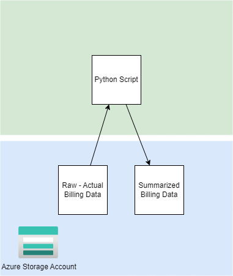

# Python Transform Billing Data

This project shows how to work with Azure billing data using Python. The project uses the Azure SDK for Python to access the billing data and transform it into various reports.



## Setup

### Prerequisites

- Azure Billing Exports Configured
- Azure Storage Account
- Python environment

### Clone and Run the Example

Configure the environment variables. Copy `example.env` to `.env` and update the values

```bash
# Clone the repository
git clone

# Configure the environment variables. Copy `example.env` to `.env` and update the values
cp example.env .env

# load .env vars (optional)
[ -f .env ] && while IFS= read -r line; do [[ $line =~ ^[^#]*= ]] && eval "export $line"; done < .env

python ./script/main.py --source "$STORAGE_URL"
```

This will create several reports in the `output` folder.

- `cost_by_account.csv`
- `cost_by_meter.csv`
- `cost_by_month.csv`
- `cost_by_subscription.csv`

# Development

You'll need to set up a development environment if you want to develop a new feature or fix issues. The project uses a docker based devcontainer to ensure a consistent development environment.

- Open the project in VSCode and it will prompt you to open the project in a devcontainer. This will have all the required tools installed and configured.

## Setup local dev environment

If you use the devcontainer image you need to log into the Container registry

```bash
# load .env vars (optional)
[ -f .env ] && while IFS= read -r line; do [[ $line =~ ^[^#]*= ]] && eval "export $line"; done < .env

az login --use-device-code --tenant "$AZURE_TENANT_ID"
az acr login --name $REGISTRY_LOGIN_SERVER
```

If you want to develop outside of a docker devcontainer you can use the following commands to setup your environment.

```bash
# Configure the environment variables. Copy example.env to .env and update the values
cp example.env .env

# load .env vars
# [ ! -f .env ] || export $(grep -v '^#' .env | xargs)
# or this version allows variable substitution and quoted long values
# [ -f .env ] && while IFS= read -r line; do [[ $line =~ ^[^#]*= ]] && eval "export $line"; done < .env

# Create and activate a python virtual environment
# Windows
# virtualenv \path\to\.venv -p path\to\specific_version_python.exe
# C:\Users\!Admin\AppData\Local\Programs\Python\Python312\python.exe -m venv .venv
# .venv\scripts\activate

# Linux
# virtualenv .venv /usr/local/bin/python3.12
# python3.12 -m venv .venv
# python3 -m venv .venv
python3 -m venv .venv
source .venv/bin/activate

# Update pip
python -m pip install --upgrade pip

# Install dependencies
pip install -r requirements_dev.txt

# Configure linting and formatting tools
sudo apt-get update
sudo apt-get install -y shellcheck
pre-commit install

# Install the package locally
pip install --editable .
```

## Style Guidelines

This project enforces quite strict [PEP8](https://www.python.org/dev/peps/pep-0008/) and [PEP257 (Docstring Conventions)](https://www.python.org/dev/peps/pep-0257/) compliance on all code submitted.

We use [Black](https://github.com/psf/black) for uncompromised code formatting.

Summary of the most relevant points:

- Comments should be full sentences and end with a period.
- [Imports](https://www.python.org/dev/peps/pep-0008/#imports) should be ordered.
- Constants and the content of lists and dictionaries should be in alphabetical order.
- It is advisable to adjust IDE or editor settings to match those requirements.

### Use new style string formatting

Prefer [`f-strings`](https://docs.python.org/3/reference/lexical_analysis.html#f-strings) over `%` or `str.format`.

```python
# New
f"{some_value} {some_other_value}"
# Old, wrong
"{} {}".format("New", "style")
"%s %s" % ("Old", "style")
```

One exception is for logging which uses the percentage formatting. This is to avoid formatting the log message when it is suppressed.

```python
_LOGGER.info("Can't connect to the webservice %s at %s", string1, string2)
```

### Testing

Ideally, all code is checked to verify the following:

All the unit tests pass All code passes the checks from the linting tools To run the linters, run the following commands:

```bash
# Use pre-commit scripts to run all linting
pre-commit run --all-files

# Run a specific linter via pre-commit
pre-commit run --all-files codespell

# Run linters outside of pre-commit
codespell .
shellcheck -x ./script/*.sh
rstcheck README.rst
```

# References

- Package Python Projects https://packaging.python.org/en/latest/tutorials/packaging-projects/
